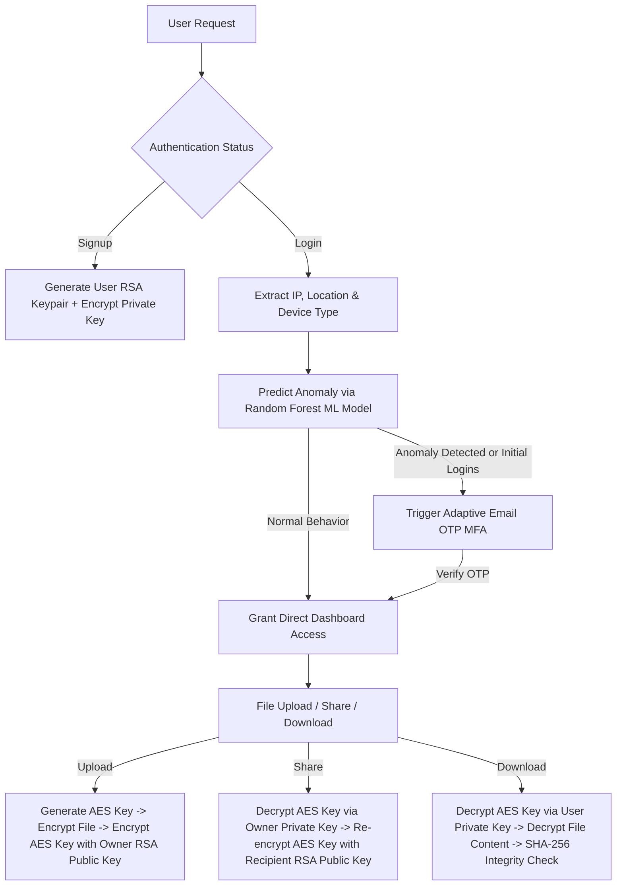

AI-Powered Anomaly Detection & Secure Hybrid Cryptographic File Storage Platform
📌 Project Overview

This project is a Multi-Layered Security and AI-Driven File Storage Platform developed using Django (Python). It is designed to provide enterprise-grade protection for user accounts and files by integrating user behavior monitoring, machine learning-based anomaly detection, adaptive multi-factor authentication (MFA), and hybrid cryptography (RSA + AES/Fernet).

The platform follows a complete end-to-end security workflow in which every user activity—including login, file upload, file sharing, and file download—is continuously monitored and recorded. During authentication, the system verifies the user's IP address, geolocation, and device information before evaluating the login attempt using a machine learning model. If suspicious or abnormal behavior is detected, the platform automatically enforces adaptive Multi-Factor Authentication (MFA) to ensure only legitimate users gain access.

To guarantee maximum data confidentiality, the platform employs a Zero-Knowledge Hybrid Encryption Architecture. Every uploaded file is encrypted using a unique symmetric encryption key, while the encryption key itself is secured using the owner's RSA public key. This approach ensures that files remain inaccessible to unauthorized users—even if the storage server is compromised.

The platform combines artificial intelligence with modern cryptographic techniques to deliver a secure, intelligent, and scalable cloud file storage solution capable of detecting suspicious activities, preventing unauthorized access, and protecting sensitive user data.

 ## 🏗️ Technology Stack

| Category | Technologies |
|----------|--------------|
| **Backend** | Django 5.x, Python |
| **Database** | SQLite3, Django ORM |
| **Machine Learning** | Scikit-learn, Pandas, Joblib, Random Forest Classifier |
| **Location Services** | GeoIP2, OpenStreetMap Nominatim API |
| **Authentication** | Django OTP, Email-Based MFA |
| **Cryptography** | RSA-2048, AES/Fernet, PBKDF2-HMAC, SHA-256, HMAC-SHA256 |
| **Frontend** | HTML5, CSS3, Bootstrap, Chart.js |

## ✨ Features

- AI-powered anomaly detection using Random Forest
- Adaptive Multi-Factor Authentication (Email OTP)
- Hybrid RSA + AES encryption
- Zero-Knowledge file storage architecture
- Secure file upload, sharing, and download
- End-to-end encrypted file sharing
- SHA-256 file integrity verification
- HMAC-based notification verification
- Geolocation and device tracking
- Real-time activity logging and audit trail
- Interactive analytics dashboard

🔄 Complete End-to-End Workflow:


    
## 🗄️ Database Models Summary

| Model Name | Purpose / Functionality |
| :--- | :--- |
| `User` (Django Core) | Core authentication user record |
| `UserProfile` | One-to-one link holding user's RSA Public Key & Encrypted Private Key, OTP attempts & login counters |
| `CustomEmailDevice` | Subclassed Email OTP Device tracking token generation timestamp & validity window |
| `ActivityLog` | Audit log capturing user actions, IP address, coordinates, city, country, timestamp & ML anomaly flags |
| `SecureFile` | File metadata storage holding owner link, SHA-256 hash, file path & RSA-encrypted Fernet file key |
| `FileShare` | Mapping for shared files containing recipient link, expiration date, revocation status & recipient-encrypted key |
| `FileDownload` | Download audit history tracking which user downloaded which file at what time |

---

## 🔐 Cryptography & Key Management Summary

```
+-----------------------------------------------------------------------------------+
| USER REGISTRATION & KEY PAIR CREATION                                            |
| Password + Salt ---> PBKDF2HMAC (100k rounds) ---> User Derived Key               |
| RSA 2048-bit Keypair generated                                                   |
| - Public Key  ---> Stored in PEM format in UserProfile.public_key                 |
| - Private Key ---> Encrypted with Fernet(User Derived Key) -> UserProfile.private|
+-----------------------------------------------------------------------------------+
| FILE ENCRYPTION                                                                   |
| Raw File Data + Fernet(Random AES File Key) ---> Encrypted File on Disk           |
| AES File Key + RSA_Encrypt(Owner Public Key) ---> SecureFile.encrypted_key        |
+-----------------------------------------------------------------------------------+
| RE-ENCRYPTION FOR SHARING                                                         |
| SecureFile.encrypted_key + RSA_Decrypt(Owner Private Key) ---> AES File Key       |
| AES File Key + RSA_Encrypt(Recipient Public Key) ---> FileShare.encrypted_key     |
+-----------------------------------------------------------------------------------+
```

---

## 📁 Directory Structure (Project Layout)

```
AnomalyDetection/
├── .env                              # Environment variable configurations
├── train_model.py                    # Script to train ML Random Forest anomaly classifier
├── README.md                         # Detailed project documentation (this file)
└── anomaly_detection/                # Main Django project directory
    ├── manage.py                     # Django management script
    ├── GeoLite2-City.mmdb            # MaxMind GeoIP database binary for location fallback
    ├── db.sqlite3                    # SQLite database file
    ├── anomaly_detection/            # Core project settings module
    │   ├── settings.py               # Django configuration file
    │   ├── urls.py                   # Master URL dispatcher
    │   ├── wsgi.py / asgi.py         # Server entrypoints
    ├── models/                       # Model store directory
    │   └── anomaly_model.pkl         # Serialized Random Forest ML model
    ├── data/                         # Training data store
    │   └── user_activity_data.csv    # User activity dataset
    ├── media/                        # Encrypted stored files directory
    │   └── secure_files/
    └── accounts/                     # Primary Django Application
        ├── models.py                 # DB models (UserProfile, SecureFile, FileShare, etc.)
        ├── views.py                  # All view functions & request handlers
        ├── urls.py                   # App-specific URL routes
        ├── forms.py                  # Signup, Login, OTP, Upload & Share forms
        ├── utils.py                  # Helper utilities
        ├── services/                 # Business logic service layer
        │   ├── crypto_service.py     # RSA & AES hybrid encryption logic
        │   ├── location_service.py   # IP parsing & GeoIP location lookup
        │   ├── ml_service.py         # Anomaly model feature extraction & prediction
        │   └── activity_service.py   # Audit logging & email notifications
        └── templates/                # HTML templates (Dashboard, Login, Signup, etc.)
```

---

## 🚀 How to Run the Project (Chalaney Ka Tarika)

### 1. Requirements Setup
Ensure Python 3.10+ is installed. Install required packages:
```bash
pip install django scikit-learn pandas joblib cryptography geoip2 requests django-otp
```

### 2. Machine Learning Model Training (Optional/Initial)
Train the Random Forest Anomaly Detection Model:
```bash
python train_model.py
```
*This outputs `models/anomaly_model.pkl`.*

### 3. Database Migration
Navigate to the `anomaly_detection` folder and apply migrations:
```bash
cd anomaly_detection
python manage.py makemigrations
python manage.py migrate
```

### 4. Run Development Server
Start the Django server:
```bash
python manage.py runserver
```
Visit `http://127.0.0.1:8000/` in your browser.

---

## 🚀 Future Enhancements

- Docker Deployment
- PostgreSQL Support
- Redis Caching
- JWT Authentication
- OAuth Login
- Mobile Application
- AWS S3 Storage
- Kubernetes Deployment
- Deep Learning–based Anomaly Detection
  
## 🛡️ Key Security Highlights

1. **Zero-Knowledge Architecture:** Server baseline storage never contains plaintext files or unencrypted private keys.
2. **Adaptive Anomaly Security:** AI model continuously monitors behavior and forces Email OTP step-up verification whenever IP/Location/Device parameters deviate from expected patterns.
3. **Cryptographic Integrity:** Files cannot be tampered with on disk without failing SHA-256 verification upon download. Shared email notifications feature HMAC-SHA256 verification.
