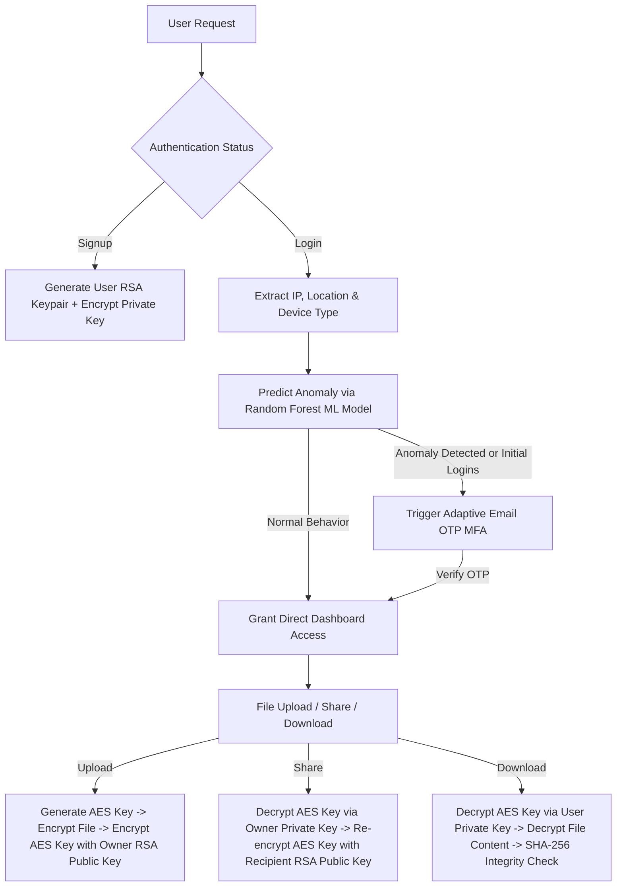

# AI-Powered Anomaly Detection & Secure Hybrid Cryptographic File Storage Platform

---

## 📌 Overview (Project Khulasa)

Yeh project aik **Multi-Layered Security & AI-Driven File Storage Platform** hai jo Django (Python) par base karta hai. Iska maqsad user behavior monitoring, machine learning-based anomaly detection, adaptive multi-factor authentication (MFA), aur high-level hybrid cryptography (RSA + AES/Fernet) ka istemal karke user files aur user accounts ko maximum security provide karna hai.

System end-to-end follow karta hai jisme har user action (login, file upload, file share, download) log hota hai, geolocation/IP verify hota hai, Machine Learning model threat level detect karta hai, aur files end-to-end zero-knowledge hybrid encryption se secure ki jati hain.

---

## 🏗️ Architecture & Tech Stack

- **Backend Framework:** Django 5.x (Python)
- **Database:** SQLite3 / Django ORM
- **Machine Learning (AI):** `scikit-learn` Random Forest Classifier (`train_model.py`), `joblib`, `pandas`
- **Geolocation & IP Tracking:** `GeoIP2` (`GeoLite2-City.mmdb`), OpenStreetMap Nominatim API, Request Header IP Extraction
- **Cryptography & Security:**
  - **Asymmetric:** RSA-2048 (OAEP Padding with SHA-256)
  - **Symmetric:** AES-256 / Fernet Key Encryption
  - **Key Derivation:** PBKDF2HMAC with SHA-256 (100,000 iterations)
  - **Integrity Verification:** SHA-256 File Hashing, HMAC-SHA256 Notification Verification
- **Multi-Factor Authentication (MFA):** Custom Email Device OTP (`django_otp`)
- **Analytics & Visualizations:** Chart.js, HTML5, CSS3, Bootstrap

---

## 🔄 End-to-End Complete Workflows (Tamam Flows Detail Mein)



---

### 1️⃣ User Signup & Cryptographic Key Generation Flow
**Files Involved:** `accounts/views.py` (`signup`), `accounts/services/crypto_service.py` (`generate_user_key_pair`), `accounts/models.py` (`UserProfile`)

1. User signup form par `username`, `email`, aur `password` fill karta hai.
2. System standard Django `User` account create karta hai aur saath hi `UserProfile` model attach karta hai.
3. **Keypair Generation:**
   - System `crypto_service.generate_user_key_pair(password)` call karta hai.
   - Aik naya **RSA-2048 keypair** generate hota hai.
   - **Public Key:** Plaintext PEM format mein generate hoti hai aur `UserProfile.public_key` field mein save ho jati hai.
   - **Private Key Encryption:** User password se **PBKDF2HMAC (SHA-256, 100,000 iterations, 16-byte random salt)** ke zariye ek Secret Key derive ki jati hai. Is derived key se Private Key ko **Fernet (AES-128-CBC)** se encrypt karke `UserProfile.private_key` mein store kiya jata hai.
4. User account login ke liye tayar ho jata hai.

---

### 2️⃣ Smart Login & Adaptive Anomaly Detection Flow
**Files Involved:** `accounts/views.py` (`login_view`), `accounts/services/location_service.py`, `accounts/services/ml_service.py`, `accounts/services/activity_service.py`

1. User login credentials (`username`, `password`) submit karta hai.
2. **IP & Location Extraction:**
   - `location_service.get_ip_address(request)` user ka IP address request headers (`HTTP_X_FORWARDED_FOR` / `REMOTE_ADDR`) se nikalta hai (local environment mein fallback `8.8.8.8` par karta hai).
   - `location_service.get_location_data()` browser geolocation (latitude/longitude) check karta hai, Nominatim API se reverse geocoding karta hai. Agar browser coords na milain to `GeoLite2-City.mmdb` database se IP-based location (latitude, longitude, city, country) retrieve karta hai.
   - `get_device_type(request)` User-Agent header analyze karke device (`Desktop`, `Mobile`, `Tablet`) identify karta hai.
3. **Adaptive MFA Decision Logic:**
   - System check karta hai ke user ka `otp_verification_count < 4` (new user grace period/onboarding phase) hai ya nahi. Agar threshold se kam ho, to **OTP mandatory** hota hai.
   - Agar user old user ho, to `ml_service.predict_activity_anomaly()` execute hota hai:
     - Features array construct hota hai: `[latitude, longitude, hour_of_day, day_of_week, ip_first_octet, action_encoded, device_type_encoded, session_duration]`.
     - Trained Random Forest Model (`models/anomaly_model.pkl`) run hota hai.
     - Model predict karta hai: `1` (Anomaly / Suspicious Login) ya `0` (Normal Login).
   - **Condition for OTP:** Agar `model_anomaly == True` ho YA location resolve na ho sake, to system **MFA / OTP trigger** kar deta hai.
4. **Activity Logging:** `record_activity()` call karke current attempt `ActivityLog` DB table mein log hota hai (with `is_anomaly` flag).

---

### 3️⃣ Multi-Factor Authentication (OTP) Flow
**Files Involved:** `accounts/views.py` (`verify_otp`), `accounts/models.py` (`CustomEmailDevice`), `accounts/services/activity_service.py` (`send_user_email`)

1. Jab login step mein OTP required hota hai, system `CustomEmailDevice` model lookup/create karta hai.
2. 6-digit random code (e.g. `839201`) generate hota hai jiski validity **10 minutes (600 seconds)** set hoti hai (`OTP_EMAIL_TOKEN_VALIDITY`).
3. User ko OTP email ke zariye send hota hai aur request redirect ho jati hai `verify_otp` page par (Session mein `user_id` retain hota hai).
4. User OTP input karta hai:
   - `verify_token(token)` check karta hai ke OTP match karta hai aur 10 minutes expire nahi huay.
   - Verification success hone par `profile.otp_verification_count` 1 increment hota hai, `email_verified = True` update hota hai, aur user dashboard par login ho jata hai.
   - Invalid OTP par error alert show hota hai.

---

### 4️⃣ Secure File Upload & Hybrid Encryption Flow
**Files Involved:** `accounts/views.py` (`upload_file`), `accounts/models.py` (`SecureFile`), `accounts/services/crypto_service.py` (`encrypt_and_save_file`)

1. User file choose karta hai aur apna password enter karta hai.
2. User ka password re-verify / authenticate hota hai.
3. **Hybrid Encryption Steps:**
   - **File Hash:** Source file content ka **SHA-256 digest** nikal kar file integrity tracking ke liye save kiya jata hai.
   - **AES File Key Generation:** Har file ke liye aik fresh random symmetric key `file_key = Fernet.generate_key()` generate ki jati hai.
   - **File Encryption:** File ka raw data `Fernet(file_key)` se encrypt ho kar disk par `media/secure_files/` directory mein write ho jata hai. Raw unencrypted file storage par kabi save nahi hoti.
   - **File Key Encryption:** Owner ka RSA Public Key (`owner_profile.public_key`) load kiya jata hai. `file_key` ko RSA-2048 (OAEP Padding with SHA-256) se encrypt kar ke `SecureFile.encrypted_key` binary column mein store kiya jata hai.
4. File upload complete hoti hai aur `ActivityLog` update ho jata hai (`action='upload'`).

---

### 5️⃣ Secure File Sharing & Zero-Knowledge Key Re-encryption Flow
**Files Involved:** `accounts/views.py` (`share_file`), `accounts/models.py` (`FileShare`), `accounts/services/crypto_service.py` (`encrypt_file_key_for_recipient`, `get_file_key_for_owner`)

1. File owner Dashboard se **Share** button click karta hai, recipient ka email enter karta hai, aur apna account password input karta hai.
2. **Zero-Knowledge Key Transmutation / Re-encryption:**
   - System owner ka encrypted private key owner ke password se decrypt karta hai (`get_user_private_key`).
   - Owner ka private key file ki `SecureFile.encrypted_key` ko decrypt karke original symmetric `file_key` retrieve karta hai.
   - Target recipient user ka profile lookup hota hai aur recipient ka **RSA Public Key** fetch kiya jata hai.
   - Symmetric `file_key` ab recipient ke RSA Public Key se re-encrypt ho jati hai (`encrypt_file_key_for_recipient`).
3. System database mein `FileShare` record create karta hai containing:
   - `file`: Link to `SecureFile`
   - `shared_with`: Link to recipient User
   - `encrypted_key`: Re-encrypted `file_key` for recipient
   - `expiration_date`: Default 7 days from share time
   - `is_revoked`: False
4. **HMAC Notification Verification:**
   - System standard message generate karta hai aur **HMAC-SHA256** signature calculate karke recipient ko email bhejta hai taake recipient link integrity verify ho sake.

---

### 6️⃣ Secure File Download & Decryption Flow
**Files Involved:** `accounts/views.py` (`download_file`), `accounts/models.py` (`FileDownload`), `accounts/services/crypto_service.py` (`decrypt_file_for_owner`, `decrypt_file_for_recipient`)

1. User (owner ya shared recipient) file download request karta hai aur apna password input karta hai.
2. **Permission & Expiration Checks:**
   - System verification karta hai: Kya user owner hai YA validity window ke andar shared recipient hai?
   - Agar shared file ka access revoke ho chuka hai (`is_revoked=True`) ya expiration date pass ho chuki hai (`timezone.now() > expiration_date`), to access deny ho jata hai.
3. **Decryption Process:**
   - **Case A (Owner):** User password se owner ka RSA Private Key decrypt hota hai -> `encrypted_key` decrypt ho kar `file_key` banta hai -> Fernet file content decrypt karta hai.
   - **Case B (Recipient):** User password se recipient ka RSA Private Key decrypt hota hai -> `FileShare.encrypted_key` decrypt ho kar `file_key` banta hai -> Fernet file content decrypt karta hai.
4. **Integrity Validation:** Decrypted content ka SHA-256 hash recalculate hota hai aur stored `file_hash` se match kiya jata hai. Agar integrity clean ho to HTTP octet-stream download serve hota hai.
5. Record `FileDownload` table mein create hota hai aur `ActivityLog` update hota hai (`action='download'`).

---

### 7️⃣ Machine Learning Training & Inference Pipeline Flow
**Files Involved:** `train_model.py`, `accounts/services/ml_service.py`, `data/user_activity_data.csv`, `models/anomaly_model.pkl`

1. **Dataset Structure:** `data/user_activity_data.csv` contains historical user session data:
   - Features: `latitude`, `longitude`, `hour_of_day`, `day_of_week`, `ip_first_octet`, `action_encoded` (0: login, 1: upload, 2: share, 3: download), `device_type_encoded` (0: Desktop, 1: Mobile, 2: Tablet, 3: Unknown), `session_duration`.
   - Target Label: `is_anomaly` (0 for normal, 1 for anomaly).
2. **Model Training Script (`train_model.py`):**
   - Data import aur preprocessing train/test split (80/20 ratio).
   - `RandomForestClassifier(n_estimators=100, class_weight='balanced', random_state=42)` train hota hai.
   - Model performance evaluate hone ke baad binary model `models/anomaly_model.pkl` file mein `joblib.dump()` ke zariye store ho jata hai.
3. **Live Inference (`ml_service.py`):**
   - Application startup/request time par model lazy-load hota hai.
   - Live parameters encode ho kar DataFrame structure mein converted hotey hain aur prediction real-time calculate hoti hai.

---

### 8️⃣ Analytics Dashboard & Activity Logging Flow
**Files Involved:** `accounts/views.py` (`dashboard`), `accounts/models.py` (`ActivityLog`, `FileDownload`, `SecureFile`), `templates/dashboard.html`

1. Dashboard user ke saare activity metrics gather karta hai:
   - Real-time Activity Logs (IP address, Timestamp, Geolocation, Anomaly Flag).
   - Owned files list, Shared files list with expiration countdowns.
   - Hour-wise Uploads trend graph, Day-wise Shares trend graph, Day-wise Downloads graph (Django ORM aggregation using `TruncHour` and `TruncDay`).
2. Visual Interactive charts render hotey hain for monitoring usage and security status.

---

## 🗄️ Database Models Summary

| Model Name | Purpose / Functionality |
| :--- | :--- |
| `User` (Django Core) | Core authentication user record |
| `UserProfile` | One-to-one link holding user's RSA Public Key & Encrypted Private Key, OTP attempts & login counters |
| `CustomEmailDevice` | Subclassed Email OTP Device tracking token generation timestamp & validity window |
| `ActivityLog` | Audit log capturing user actions, IP address, coordinates, city, country, timestamp & ML anomaly flags |
| `SecureFile` | File metadata storage holding owner link, SHA-256 hash, file path & RSA-encrypted Fernet file key |
| `FileShare` | Mapping for shared files containing recipient link, expiration date, revocation status & recipient-encrypted key |
| `FileDownload` | Download audit history tracking which user downloaded which file at what time |

---

## 🔐 Cryptography & Key Management Summary

```
+-----------------------------------------------------------------------------------+
| USER REGISTRATION & KEY PAIR CREATION                                            |
| Password + Salt ---> PBKDF2HMAC (100k rounds) ---> User Derived Key               |
| RSA 2048-bit Keypair generated                                                   |
| - Public Key  ---> Stored in PEM format in UserProfile.public_key                 |
| - Private Key ---> Encrypted with Fernet(User Derived Key) -> UserProfile.private|
+-----------------------------------------------------------------------------------+
| FILE ENCRYPTION                                                                   |
| Raw File Data + Fernet(Random AES File Key) ---> Encrypted File on Disk           |
| AES File Key + RSA_Encrypt(Owner Public Key) ---> SecureFile.encrypted_key        |
+-----------------------------------------------------------------------------------+
| RE-ENCRYPTION FOR SHARING                                                         |
| SecureFile.encrypted_key + RSA_Decrypt(Owner Private Key) ---> AES File Key       |
| AES File Key + RSA_Encrypt(Recipient Public Key) ---> FileShare.encrypted_key     |
+-----------------------------------------------------------------------------------+
```

---

## 📁 Directory Structure (Project Layout)

```
AnomalyDetection/
├── .env                              # Environment variable configurations
├── train_model.py                    # Script to train ML Random Forest anomaly classifier
├── README.md                         # Detailed project documentation (this file)
└── anomaly_detection/                # Main Django project directory
    ├── manage.py                     # Django management script
    ├── GeoLite2-City.mmdb            # MaxMind GeoIP database binary for location fallback
    ├── db.sqlite3                    # SQLite database file
    ├── anomaly_detection/            # Core project settings module
    │   ├── settings.py               # Django configuration file
    │   ├── urls.py                   # Master URL dispatcher
    │   ├── wsgi.py / asgi.py         # Server entrypoints
    ├── models/                       # Model store directory
    │   └── anomaly_model.pkl         # Serialized Random Forest ML model
    ├── data/                         # Training data store
    │   └── user_activity_data.csv    # User activity dataset
    ├── media/                        # Encrypted stored files directory
    │   └── secure_files/
    └── accounts/                     # Primary Django Application
        ├── models.py                 # DB models (UserProfile, SecureFile, FileShare, etc.)
        ├── views.py                  # All view functions & request handlers
        ├── urls.py                   # App-specific URL routes
        ├── forms.py                  # Signup, Login, OTP, Upload & Share forms
        ├── utils.py                  # Helper utilities
        ├── services/                 # Business logic service layer
        │   ├── crypto_service.py     # RSA & AES hybrid encryption logic
        │   ├── location_service.py   # IP parsing & GeoIP location lookup
        │   ├── ml_service.py         # Anomaly model feature extraction & prediction
        │   └── activity_service.py   # Audit logging & email notifications
        └── templates/                # HTML templates (Dashboard, Login, Signup, etc.)
```

---

## 🚀 How to Run the Project (Chalaney Ka Tarika)

### 1. Requirements Setup
Ensure Python 3.10+ is installed. Install required packages:
```bash
pip install django scikit-learn pandas joblib cryptography geoip2 requests django-otp
```

### 2. Machine Learning Model Training (Optional/Initial)
Train the Random Forest Anomaly Detection Model:
```bash
python train_model.py
```
*This outputs `models/anomaly_model.pkl`.*

### 3. Database Migration
Navigate to the `anomaly_detection` folder and apply migrations:
```bash
cd anomaly_detection
python manage.py makemigrations
python manage.py migrate
```

### 4. Run Development Server
Start the Django server:
```bash
python manage.py runserver
```
Visit `http://127.0.0.1:8000/` in your browser.

---

## 🛡️ Key Security Highlights

1. **Zero-Knowledge Architecture:** Server baseline storage never contains plaintext files or unencrypted private keys.
2. **Adaptive Anomaly Security:** AI model continuously monitors behavior and forces Email OTP step-up verification whenever IP/Location/Device parameters deviate from expected patterns.
3. **Cryptographic Integrity:** Files cannot be tampered with on disk without failing SHA-256 verification upon download. Shared email notifications feature HMAC-SHA256 verification.
